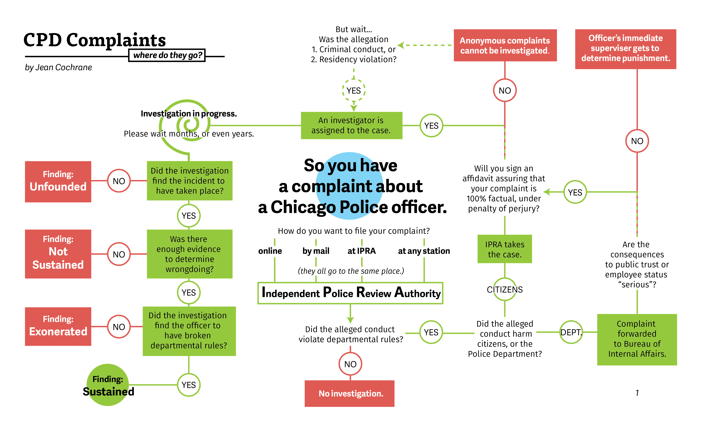
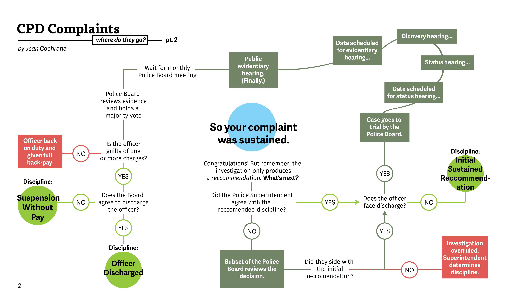

```{r load-packages, include = FALSE}
# Add any additional packages you need to this chunk
library(tidyverse)
library(tidymodels)
library(palmerpenguins)
library(knitr)
library(xaringanthemer)
```

```{r setup, include=FALSE}
# For better figure resolution
knitr::opts_chunk$set(fig.retina = 3, dpi = 300, fig.width = 6, fig.asp = 0.618, out.width = "90%", warning = FALSE, message = FALSE, echo = FALSE)
```

```{r load our packages, include = FALSE}
library(knitr)
library(tidyverse)
library(readr)
library(tidyverse)
library(forcats)
library(kableExtra)
library(sf)
library(leaflet)
library(leafsync)
#install.packages("naniar")
library(naniar)
# set default options
#devtools::install_github("thomasp85/patchwork")
library(patchwork)

```

```{r Reading in the data, echo=FALSE, message=FALSE, warning = FALSE}

district_demographics <- read_csv("https://raw.githubusercontent.com/invinst/chicago-police-data/master/data/context_data/district_demographics/Districts.csv")

active_duty_officers <- read_csv("https://raw.githubusercontent.com/invinst/chicago-police-data/master/data/context_data/CPD%20Employees%20active-duty-only.csv")

#The officers accused
complaints_accused <- read_csv("../data/complaints-accused_2000-2016_2016-11.csv")

#those who made the complaints
complainants <- read_csv("../data/complaints-complainants_2000-2016_2016-11 (1).csv")

#What complaints were made (more categorical data)
complaints_made <- read_csv("../data/complaints-complaints_2000-2016_2016-11 (1).csv")

units <- read.csv("https://raw.githubusercontent.com/invinst/chicago-police-data/master/data/context_data/current_and_past_units/Current_and_Past_CPD_Units_2016-05-06.csv")

```

```{r background-image, include = FALSE}
style_xaringan(
  title_slide_background_image = "img/Chicago.jpg",
  title_slide_text_color = "#FFFFFF")
```

# Introduction
--

- The data set is extensive and includes information about complaints against Chicago police officers from 1988 to 2018.

--

-  Our data was collected by the Invisible Institute, an investigative journalism company as part of their Citizen Police Data Project.

--

- The Invisible Institute sued the city of Chicago for the release of complaint records against the Chicago Police Department.

--

- The files were released in 2016, revealing over 100,000 complaint records to the public.

--

- Why we chose Chicago

---
# Our Research Questions
--

- What are the racial makeups of different neighborhoods in Chicago? 

--

- In which neighborhoods are there the most police complaints per capita?

--

- What are the outcomes of police complaints in these neighborhoods?

---
class: center, inverse, middle

# What are the racial makeups of different neighborhoods in Chicago? 

---

# Racial makeup of Chicago neighborhoods

```{r leaflet data prep, echo = FALSE, warning = FALSE, message = FALSE, include = FALSE}

district_complaints <- complaints_accused %>%
  filter(current_unit %in% 1:25) %>%
  group_by(current_unit) %>%
  summarise(n = n()) %>%
  arrange(desc(n))

total_district_complaints <- full_join(district_complaints,
                                       district_demographics,
                                       by = c("current_unit" = "District_No")) %>%
  mutate(complaints_per_capita = n/Population)

chicago_police_district_spatial <- st_read(dsn = "/cloud/project/data/geo_export_2efb16ec-aa66-49b0-92a0-2d6f5e0f81d9.shp")

total_district_complaints_spatial <- total_district_complaints %>%
  mutate(`Latino%` = str_remove(`Latino%`, "%"),
         `White%` = str_remove(`White%`, "%"),
         `Black%` = str_remove(`Black%`, "%"),
         `Asian%` = str_remove(`Asian%`, "%"),
         `Native_American%` = str_remove(`Native_American%`, "%"),
         `Other%` = str_remove(`Other%`, "%"),
         `Latino%` = as.numeric(`Latino%`),
         `White%` = as.numeric(`White%`),
         `Black%` = as.numeric(`Black%`),
         `Asian%` = as.numeric(`Asian%`),
         `Native_American%` = as.numeric(`Native_American%`),
         `Other%` = as.numeric(`Other%`)) %>%
  mutate(current_unit = as.character(current_unit))%>%
  left_join(chicago_police_district_spatial,
                                    by = c("current_unit" = "dist_num")) %>%
  st_as_sf() %>%
  st_transform("+init=epsg:4326")

```

``` {r leaflet-demographics, fig.width = 10, out.width = "150%", fig.alt = "Leaflet Maps of the Percentage of Black, white, and Latino residents by neighborhood. Neighborhoods are very segregated", message = FALSE, echo = FALSE, warning = FALSE, error = FALSE}

bins <- seq(from = 0, to = 100, by = 12.5)
pal_perc <- colorBin("OrRd", domain = total_district_complaints_spatial , bins = bins)

m <- leaflet(total_district_complaints_spatial) %>%
  addTiles() %>%
  setView(-87.633506, 41.876067, zoom = 9.5) %>%
  addProviderTiles(providers$CartoDB.Positron)

label_black <- sprintf("<strong>%s</strong><br/>%g percent", 
                  total_district_complaints_spatial$District_Name,
                  total_district_complaints_spatial$`Black%`) %>% 
   lapply(htmltools::HTML)

label_white <- sprintf("<strong>%s</strong><br/>%g percent", 
                  total_district_complaints_spatial$District_Name,
                  total_district_complaints_spatial$`White%`) %>% 
   lapply(htmltools::HTML)

label_latino <- sprintf("<strong>%s</strong><br/>%g percent", 
                  total_district_complaints_spatial$District_Name,
                  total_district_complaints_spatial$`Latino%`) %>% 
   lapply(htmltools::HTML)

Black_perc_m <- m %>%
  addPolygons(
    fillOpacity = 1,
    color = "black",
    opacity = 0.7,
    weight = 1,
    fillColor = ~pal_perc(total_district_complaints_spatial$`Black%`),
    highlight = highlightOptions(
        weight = 3,
        color = "blue",
        fillOpacity = 1,
        bringToFront = TRUE),
      label = label_black)
Black_perc_m <- Black_perc_m %>%
  addLegend(
    position = "topright",
    pal = pal_perc,
    values = ~total_district_complaints_spatial$`Black%`,
    title = "Percent Black Residents",
    opacity = 1)

White_perc_m <- m %>%
  addPolygons(
    fillOpacity = 1,
    color = "black",
    opacity = 0.7,
    weight = 1,
    fillColor = ~pal_perc(total_district_complaints_spatial$`White%`),
     highlight = highlightOptions(
        weight = 3,
        color = "blue",
        fillOpacity = 1,
        bringToFront = TRUE),
      label = label_white)
White_perc_m <- White_perc_m %>%
  addLegend(
    position = "topright",
    pal = pal_perc,
    values = ~total_district_complaints_spatial$`White%`,
    title = "Percent White Residents",
    opacity = 1)
 
Latino_perc_m <- m %>%
  addPolygons(
    fillOpacity = 1,
    color = "black",
    opacity = 0.7,
    weight = 1,
    fillColor = ~pal_perc(total_district_complaints_spatial$`Latino%`),
     highlight = highlightOptions(
        weight = 3,
        color = "blue",
        fillOpacity = 1,
        bringToFront = TRUE),
      label = label_latino)
Latino_perc_m <- Latino_perc_m %>%
  addLegend(
    position = "topright",
    pal = pal_perc,
    values = ~total_district_complaints_spatial$`Latino%`,
    title = "Percent Latino Residents",
    opacity = 1)

leafsync::sync(Black_perc_m, White_perc_m, Latino_perc_m, ncol = 3, sync = "all")
```

---
class: center, inverse, middle

# In which neighborhoods are there the most police complaints per capita?

---

# Where are complaints being made?

```{r data-joins, fig.alt = "Scatterplot of police complaints per capita by district name colored by racial majority. Visualization shows neighborhoods with the most complaints per capita are predominantly Black", echo = FALSE, out.width = "75%"}
district_complaints <- complaints_accused %>%
  filter(current_unit %in% 1:25) %>%
  group_by(current_unit) %>%
  summarise(n = n()) %>%
  arrange(desc(n))

total_district_complaints <- full_join(district_complaints,
                                       district_demographics,
                                       by = c("current_unit" = "District_No")) %>%
  mutate(complaints_per_capita = n/Population)

total_district_complaints %>%
  filter(is.na(District_Name) == FALSE) %>%
         ggplot(mapping = aes(
                  x = fct_reorder(District_Name, complaints_per_capita),
                  y = complaints_per_capita, 
                color = Majority)) +
  geom_point() +
  geom_segment(aes(x = fct_reorder(District_Name, complaints_per_capita), 
                   xend = fct_reorder(District_Name, complaints_per_capita), 
                   y = 0, yend = complaints_per_capita)) +
  coord_flip() +
  labs(title = "Complaints per capita by District",
       subtitle = "Colored by Racial Majority",
       x = "District",
       y = "Complaints Per capita")
```
  
---

# Complaints per capita leaflet

```{r complaints-perc-leaflet, out.width = "70%", fig.alt = "Leaflet Map Showing the complaints per capita. Highest number of complaints per capita are in neighborhoods that are majority Black, and one majority white neighboborhood, which is in the downtown center of the city", message = FALSE, echo = FALSE, warning = FALSE, error = FALSE}
# creating map showing neighborhoods with most missing data ie when the final finding is either NA (missing), NAF (no affidavit) or NC (no affidavit)
#baseline complaints per capita
 
 bins_2 <- seq(from = 0, to = 0.06, by = 0.01)
 pal_per_cap <- colorBin("OrRd", domain = total_district_complaints_spatial, bins = bins_2)
 
label_complaints <- sprintf("<strong>%s</strong><br/>%g complaints per capita", 
                total_district_complaints_spatial$District_Name,
                total_district_complaints_spatial$complaints_per_capita) %>% 
  lapply(htmltools::HTML)
 
  complaints_perc_m <- m %>%
   setView(lng = -87.6298, lat = 41.5, zoom = 10) %>%
   addPolygons(
     fillOpacity = 1,
     color = "black",
     opacity = 0.7,
     weight = 1,
     fillColor = ~pal_per_cap(total_district_complaints_spatial$`complaints_per_capita`),
      highlight = highlightOptions(
        weight = 3,
        color = "blue",
        fillOpacity = 1,
        bringToFront = TRUE),
      label = label_complaints)
       
 complaints_perc_m <- complaints_perc_m %>%
   addLegend(
     position = "topright",
     pal = pal_per_cap,
     values = ~total_district_complaints_spatial$`complaints_per_capita`,
     title = "Complaints per capita",
     opacity = 1)
 
 complaints_perc_m

```

---
class: center, inverse, middle

#What are the outcomes of police complaints in these neighborhoods?

---


``` {r image-of-complaints-destination-1} 



```
.footnote[Citizens Police Data Project]
---

``` {r image-of-complaints-destination-2} 



```
.footnote[Citizens Police Data Project]

---

# Final Finding Summary Statistics

```{r proportion-findings-vis-prep, echo = FALSE, warning = FALSE, message = FALSE, include = FALSE, out.width = "70%"}
district_complaints_1 <- complaints_accused %>%
  filter(current_unit %in% 1:25) %>%
  group_by(current_unit)

total_district_complaints_findings <- full_join(district_complaints_1,
                                       district_demographics,
                                       by = c("current_unit" = "District_No"))

#stat = "identity"

data1 <- total_district_complaints_findings %>%
  mutate(final_decision = 
           as.factor(case_when(final_finding %in% "SU" ~ "Sustained",
                               final_finding %in% "DIS" ~ "Sustained",
                               is.na(final_finding) == TRUE ~ "Missing",
                               final_finding %in% "NAF" ~ "No Affidavit or Cooperation",
                               final_finding %in% "NC" ~ "No Affidavit or Cooperation",
                               final_finding %in% "NS" ~ "Not Sustained",
                               final_finding %in% "EX" ~ "Not Sustained",
                               final_finding %in% "UN" ~ "Not Sustained",
                               ))) %>%
  group_by(final_decision, District_Name)  %>%
  summarize(n = n())
```

```{r summary-stats-prep, echo = FALSE, message = FALSE, include=FALSE}

total_district_complaints_findings %>%
  group_by(final_finding) %>%
  summarise(n = n(), perc_of_data = (n/71960)*100) %>%
  slice_max(order_by = n, n = 8) #n = 6 before
#findings_table

findings_table <- tribble(~"Final Finding", ~"Number of Complaints", ~"% of Complaint Data",
                          "Not Sustained", 21864, "30.38%",
                          "No Affidavit", 19995, "27.79%",
                          "Unfounded", 16241, "22.57%",
                          "Exonerated", 4714, "6.55%",
                          "Missing Data (NA)", 4607, "6.40%",
                          "Sustained", 4504, "6.26%",
                          "No Cooperation", 29, "0.04%",
                          "Disciplined ", 6, "0.008%")

```

.right-column[
```{r summary-stats-table, echo = FALSE}
  knitr::kable(findings_table, format = 'html')
```
]


- No Affidavit and No Cooperation mean that the complaints are not examined at all

- Not Sustained and Unfounded mean that the complaints were looked into and no wrongdoing was identified

- Sustained and Disciplined mean that when the complaints were investigated there was some finding of wrongdoing

- Exonerated mean that with there was an initial fidning of wrongdoing, that was later overturned


---
# What happens to the complaints?

```{r r proportion-findings-vis, fig.alt = "Filled bar graph shows the proportion of complaints that fit into four catagories -- Sustained, No Affidavit or Cooperation, Not sustained, and Missing.  Proportions are relatively even across the neighborhoods, with not sustained complaints making up 60 to 70% of the data, No affidavit or cooperation between 20 and 30%, and missing and sustained generally aeoounf 5% each", message = FALSE, echo = FALSE, warning = FALSE, error = FALSE, out.width = "70%"}
  data1 %>%   
  filter(is.na(District_Name) == FALSE) %>%
  ggplot(aes(fill = factor(final_decision, 
                           levels = c("Missing", 
                                      "Not Sustained", 
                                      "No Affidavit or Cooperation", 
                                      "Sustained")),
             x = fct_rev(fct_relevel(District_Name, 
                                     "Central",
                                     "Englewood",
                                     "Harrison",
                                     "Calumet",
                                     "Grand Crossing",
                                     "Gresham",
                                     "Austin",
                                     "Morgan Park",
                                     "Wentworth",
                                     "Near North",
                                     "South Chicago",
                                     "Ogden",
                                     "Lincoln",
                                     "Near West",
                                     "Chicago Lawn",
                                     "Deering",
                                     "Shakespeare",
                                     "Town Hall",
                                     "Rogers Park",
                                     "Grand Central",
                                     "Albany Park",
                                     "Jefferson Park")), 
                                     district_levels,
             y = n)) +
  geom_bar(position = "fill", stat = "identity") +
  theme_minimal() +
  scale_fill_viridis_d() +
  coord_flip() +
   labs(title = "Proportion of Final Findings",
        subtitle = "By District (In descending order of per capita complaints)",
        x = "District Name",
        y = "Proportion of Complaints",
        fill = "Final Decision"
        ) 
```
---

# Sustained complaints

```{r complaints-for-sustained-decisions-prep, echo = FALSE, warning = FALSE, message = FALSE, include = FALSE, out.width = "70%"}

sustained_data <- total_district_complaints_findings %>%
  group_by(final_finding, District_Name, Majority, Population) %>%
  filter(final_finding == "SU") %>%
  filter(is.na(District_Name) == FALSE) %>%

  summarize(n = n()) %>%
  mutate(complaints_per_capita = n/Population)
```
  
```{r complaints-for-sustained-decisions, message = FALSE, echo = FALSE, warning = FALSE, error = FALSE, out.width = "70%", fig.alt= "Scatterplot of sustained police complaints per capita by district name colored by racial majority. Sustained complaints indicate that the allegation (complaint) was supported by sufficient evidence to justify disciplinary action. Recommendations of disciplinary action may range from violation noted to separation from the Department. Visualization shows districrts with the most complaints per capita are predominantly Black besides one, which is the Central District, a majority white District"}
  ggplot(data = sustained_data, 
                mapping = aes(
                x = fct_rev(fct_relevel(District_Name, 
                                     "Central",
                                     "Englewood",
                                     "Harrison",
                                     "Calumet",
                                     "Grand Crossing",
                                     "Gresham",
                                     "Austin",
                                     "Morgan Park",
                                     "Wentworth",
                                     "Near North",
                                     "South Chicago",
                                     "Ogden",
                                     "Lincoln",
                                     "Near West",
                                     "Chicago Lawn",
                                     "Deering",
                                     "Shakespeare",
                                     "Town Hall",
                                     "Rogers Park",
                                     "Grand Central",
                                     "Albany Park",
                                     "Jefferson Park")),
                  y = complaints_per_capita, 
                color = Majority)) +
  geom_point() +
    geom_segment(aes(x = fct_reorder(District_Name, complaints_per_capita), 
                     xend = fct_reorder(District_Name, complaints_per_capita), 
                   y = 0,
                   yend = complaints_per_capita)) +
  coord_flip() +
  labs(title = "Sustained Complaints per Capita",
       subtitle = "By District (In descending order of per capita complaints), Colored by Racial Majority",
       x = "District Name",
       y = " Sustained Complaints Per Capita")
```


---
# Missing Affidavits

```{r complaints-noaffidavit-decisions-prep, echo = FALSE, warning = FALSE, message = FALSE, include = FALSE}

no_ca_data <- total_district_complaints_findings %>%
  group_by(final_finding, District_Name, Majority, Population) %>%
  filter(final_finding == "NAF") %>%
  filter(is.na(District_Name) == FALSE) %>%
  summarize(n = n()) %>%
  mutate(complaints_per_capita = n/Population) 
```

```{r complaints-noaffidavit-decisions, message = FALSE, echo = FALSE, warning = FALSE, error = FALSE, out.width = "70%", fig.alt= "Scatterplot of police complaints with no affidavits per capita by district name colored by racial majority. If the accuser doesn't submit an affidavit, the anonymous complaint doesn't get investigated, unless the allegation  involved criminal conduct or a residency violation. Visualization shows neighborhoods with the most 'anonymous' complaints per capita are predominantly Black, with a few majority white districts in the middle and latino and mixed districts towards the bottom of the graph."}
  ggplot(data = no_ca_data, 
                mapping = aes(
                  x = fct_rev(fct_relevel(District_Name, 
                                     "Central",
                                     "Englewood",
                                     "Harrison",
                                     "Calumet",
                                     "Grand Crossing",
                                     "Gresham",
                                     "Austin",
                                     "Morgan Park",
                                     "Wentworth",
                                     "Near North",
                                     "South Chicago",
                                     "Ogden",
                                     "Lincoln",
                                     "Near West",
                                     "Chicago Lawn",
                                     "Deering",
                                     "Shakespeare",
                                     "Town Hall",
                                     "Rogers Park",
                                     "Grand Central",
                                     "Albany Park",
                                     "Jefferson Park")),
                  y = complaints_per_capita, 
                color = Majority)) +
  geom_point() +
    geom_segment(aes(x = fct_reorder(District_Name, complaints_per_capita), 
                     xend = fct_reorder(District_Name, complaints_per_capita), 
                   y = 0,
                   yend = complaints_per_capita)) +
  coord_flip() +
  labs(title = "Complaints Missing Affidavits per Capita by District",
       subtitle = "By District (In descending order of per capita complaints), Colored by Racial Majority",
       x = "District",
       y = "Complaints Missing Affidavit per Capita")
```

---

# Missing Complaint Data

```{r missing-complaint-data-prep, echo = FALSE, warning = FALSE, message = FALSE, include = FALSE}
missing_data <- total_district_complaints_findings %>%
  group_by(final_finding, District_Name, Majority, Population) %>%
  filter(is.na(final_finding)) %>%
  filter(!is.na(District_Name)) %>%
  summarize(n = n()) %>%
  mutate(complaints_per_capita = n/Population) 
```

```{r missing-complaint-data, message = FALSE, echo = FALSE, warning = FALSE, error = FALSE, out.width = "70%", fig.alt = "Scatterplot of missing police complaints per capita by district name colored by racial majority. Visualization shows neighborhoods with the most complaints per capita are predominantly Black besides one, which is the Central District, a majority white District"}
 ggplot(data = missing_data, 
                mapping = aes(
                  x = fct_rev(fct_relevel(District_Name, 
                                     "Central",
                                     "Englewood",
                                     "Harrison",
                                     "Calumet",
                                     "Grand Crossing",
                                     "Gresham",
                                     "Austin",
                                     "Morgan Park",
                                     "Wentworth",
                                     "Near North",
                                     "South Chicago",
                                     "Ogden",
                                     "Lincoln",
                                     "Near West",
                                     "Chicago Lawn",
                                     "Deering",
                                     "Shakespeare",
                                     "Town Hall",
                                     "Rogers Park",
                                     "Grand Central",
                                     "Albany Park",
                                     "Jefferson Park")),
                  y = complaints_per_capita, 
                color = Majority)) +
  geom_point() +
   geom_segment(aes(x = fct_reorder(District_Name, complaints_per_capita), 
                    xend = fct_reorder(District_Name, complaints_per_capita), 
                   y = 0, 
                   yend = complaints_per_capita)) +
  coord_flip() +
  labs(title = " Missing Complaints per Capita by District Name",
       subtitle = "By District (In descending order of per capita complaints), Colored by Racial Majority",
       x = "District Name",
       y = " Missing Complaints Per Capita")
```

---
#Limitations to the Data
--

- Missing 1 District (31st)

--

- 3 of those districts removed (13th, 21st, 23rd).

--

- Codebook incomplete

---

#Further Research

--

- Missing data in Black districts, why?

--

- More analysis on Central district

--

- What type of allegations were more likely to be sustained?

--

- If there’s a correlation between the type of allegations and the person who made it?

--

- Is there a correlation between the race of the officer versus the race of the accuser in these complaints?

--

- Repeat complaints

--
 
- Effectiveness of this filing complaints system (policies)

--

- Can explore how complaints have changed over the years

---
# Thank You for Listening!

Any Questions?

```{r last-slide, out.width = "70%"}


```

.footnote[Citizens Police Data Project]
